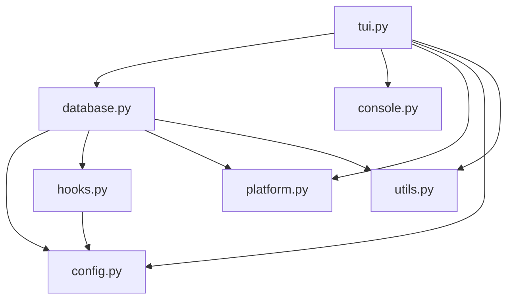

# Architecture

## Module Overview

```
timetrace/
├── __init__.py    # Package root — exports VERSION and all public classes
├── __main__.py    # Enables `python -m timetrace`
├── console.py     # Low-level terminal rendering (buffered draw, key input)
├── platform.py    # OS abstraction (app directory, idle detection)
├── config.py      # ConfigManager — JSON config read/write, THEMES, TIME_FORMAT
├── hooks.py       # HookManager (webhooks) + Notifier (OS notifications)
├── database.py    # TimeTrace core — SQLite CRUD, caching, stats, heatmap
├── tui.py         # TraceTUI — screen drawing + input routing
└── utils.py       # Standalone functions: parse_tags(), parse_time_input()
```

## Dependency Graph



## Data Flow

1. **User presses a key** → `TraceTUI._input()` dispatches to a mode handler
2. **Mode handler** calls `TimeTrace` methods (start, stop, edit, delete, etc.)
3. **TimeTrace** writes to SQLite, refreshes caches
4. **Next draw cycle**: `TraceTUI._draw()` reads cached data and renders to `Console` buffer
5. **Console.draw()** flushes the buffer to stdout as a single frame

## Database Schema

```sql
-- Core log entries (START / STOP pairs)
CREATE TABLE logs (
    id        INTEGER PRIMARY KEY,
    timestamp TEXT,    -- YYYY-MM-DD HH:MM:SS
    action    TEXT,    -- 'START' or 'STOP'
    task      TEXT     -- task/project name
);

-- Normalised tag storage
CREATE TABLE tags (
    id   INTEGER PRIMARY KEY,
    name TEXT UNIQUE NOT NULL
);

-- Many-to-many: log entries ↔ tags
CREATE TABLE log_tags (
    log_id INTEGER REFERENCES logs(id) ON DELETE CASCADE,
    tag_id INTEGER REFERENCES tags(id) ON DELETE CASCADE,
    PRIMARY KEY (log_id, tag_id)
);
```

## TUI Modes

| Mode | Screen | Key to Enter |
|------|--------|-------------|
| `DASH` | Dashboard (default) | — |
| `SELECT` | Pick recent project | `s` |
| `INPUT` | Type new task name | `n` |
| `REPORTS` | Time reports | `r` |
| `HISTORY` | Log entry manager | `h` |
| `CONFIG` | Settings editor | `c` |
| `HELP` | Keybinding reference | `?` |
| `FORGOT` / `FORGOT_TASK` | Retroactive start | `f` |
| `TAG_FILTER` | Tag picker for history | `g` (from history) |
| `EDIT_*` / `ADD_*` | Multi-step entry forms | `e` / `a` (from history) |
